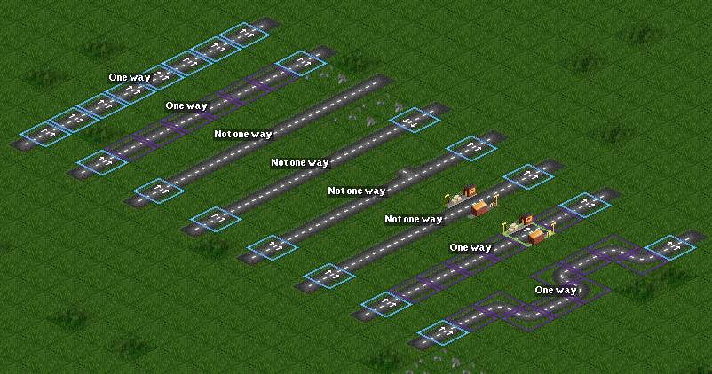
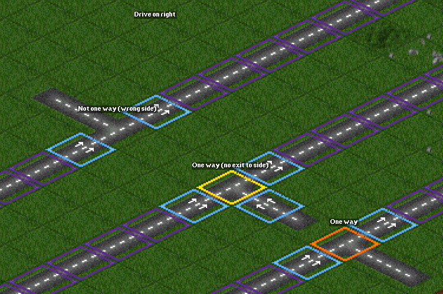
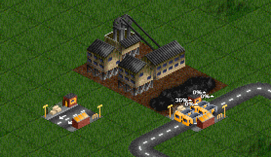

# 单行道与超车

单行道与超车功能于 0.39 被加入游戏。

这里有一些单行道的例子（这里开启分区功能以显示单行道）。如截图所示。

### 单行道块之间的道路

Road segments with no junctions or non-one-way road stops between one way road tiles are now one-way, as if every tile was manually made one way.

This also applies to corners, bridges (including custom bridge heads) and tunnels. These cannot be manually made one way.

**One way road side junctions**

One way roads may have T-junctions on the drive side (i.e. the outer/slow lane), if there is a one way road tile before and after the junction.

**One way drive-through road stops**

Drive-through road stops may be made one way, this allows both lanes to be used in the same direction.

Drive through roads stops with more than one tile should have all tiles made one way.

**Overtaking behaviour**

* Road vehicles have fewer constraints on overtaking on one-way road, and may be remain in the overtaking lane indefinitely.
* Road vehicles may now start and finish overtaking on bridges and in tunnels.

**Limitations**

* Articulated road vehicles may not go around a corner whilst overtaking.
* Road vehicles will not start overtaking on bridges with custom bridge heads.
