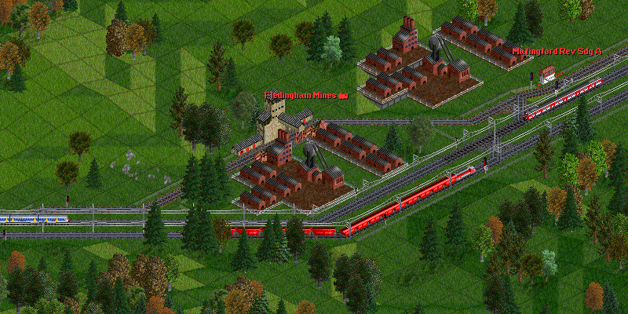
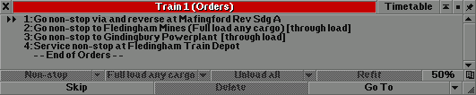
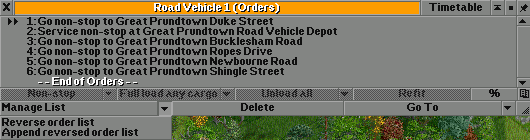
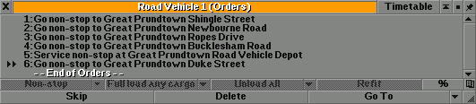
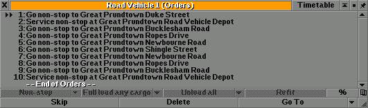

# 调度计划窗口功能

## 通过式装载

通过式装载功能允许货运列车在比自身更短的站台上以移动的方式装卸货。

通过式装载功能需要通过“Show advanced loading mode features”设置启用。
你可以在列车的调度计划窗口中将“\[近端\]”、“\[中间\]”或“\[远端\]”改为“\[通过式装载\]”。

## 反转调度命令

To reverse a vehicle's order list, or append or reversed copy of the order list, click the **End of Orders** marker.

Then select the "Reverse order list" or "Append reversed order list" options in the "Manage List" drop-down box.
(If the order management button toggle hasn't been enabled, the "Manage List" drop-down box can be temporarily shown by holding the **CTRL** key.)

Orders at start:

Orders after reversing:

Orders after appending reversed orders:

