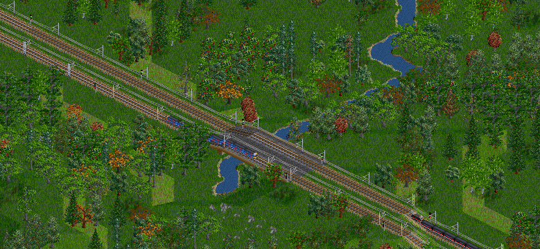
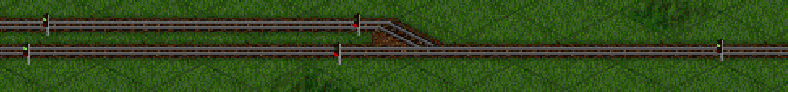
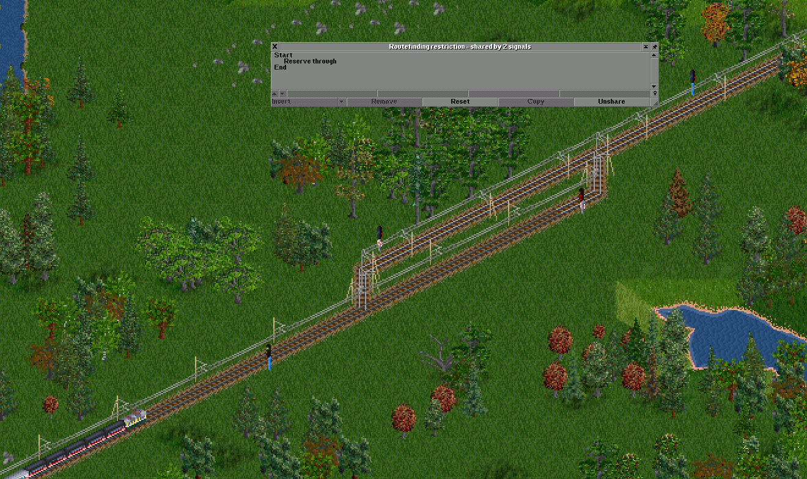
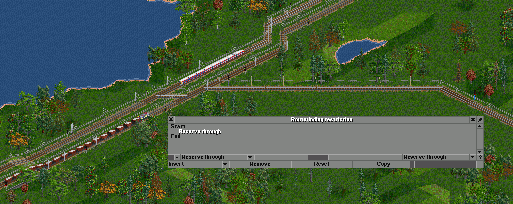
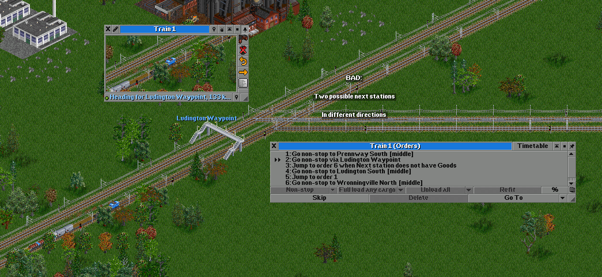
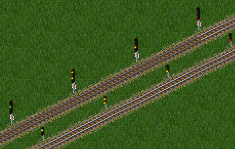

# 真实制动

真实制动于 0.40 被加入游戏中。

真实制动由“列车制动模型”选项控制。
“原版”模型允许列车立刻停止。
如果使用“现实”模型，列车需要提前预留轨道以留出足够的制动距离，无法立刻停止。

真实列车制动是一项进阶功能，对信号系统和轨道设计有很大影响，因此可能不适合新手。
启用真实制动时无法使用原版中的逻辑信号（出入口信号、复合信号、通过信号），
只能使用路径信号。

如果地图上没有有不兼容的信号，可以在游戏进行时更改制动模型。
可以使用 `find_non_realistic_braking_signal` 控制台命令找到这些信号。

## 列车行为

列车会提前制动，以便在其路径预留范围内停车，并满足预留范围内的任何速度限制。
列车会尝试提前预留，直到制动距离足够长，以便以该信号的目标速度通过**下一个**信号。
目标速度受以下因素影响：

- 列车的最高速度
- 桥梁速度限制
- 铁轨类型速度限制
- 寻路限制速度限制

此外，列车还会在以下设施/命令前提前制动：

- 停靠的车站/路点
- 弯道（启用“真实加速模型”时）
- 反向信号或路点
- 预留范围的终点（包括线路终点、车库等）
- 当前指令速度限制

列车提前预留多个信号区间的机制是通过“接续预留”实现的，
详见[信号](./Signalling.md#寻路限制)页面。
可以通过在信号机上设置寻路限制程序并使用“接续预留”和“取消接续预留”操作调整预留区间机制。

列车只有在接近或通过信号时才会延长其预留区间，
这也是列车司机（假设有这么一个人）可以获取前方轨道占用状态的唯一机会。

以下两者仍以正常方式工作：

- 已被占用的信号区间
- 其他阻止预留信号区间的寻路限制操作

与“原版”列车制动模型不同，列车可以在带有信号的桥梁上和隧道中预留空间，
以进入、离开，或通过桥梁和隧道。

改变轨道布局可能会阻碍或影响行驶中列车的预留区间。
如果列车的预留区间被影响，将拒绝修改轨道。
“正在行驶”指列车速度非零或者列车不处于停止状态。[^editing_track]

[^editing_track]: 译注：通过启用游戏中“修改轨道时忽略真实制动”设置项可以取消此限制。

## 信号行为改动

在开启真实制动时，通过信号将使用路径信号的逻辑，游戏会将其作为路径信号处理。
在所有其他情况下，通过信号灯默认显示红色，与路径信号相同。
“普通线路”意味着信号后的轨道没有岔道，并且通向另一个同方向的单向信号或线路终点。[^signal_default_green]

[^signal_default_green]: 译注：[OpenTTD#12857](https://github.com/OpenTTD/OpenTTD/pull/12857)修改了路径信号灯的默认行为。
路径信号灯现在在无岔道的轨道区间前将默认显示为绿色。

## 速度/距离计算

列车制动力和减速度的计算方式类似于列车加速度，因此也可以使用原版或真实模型来计算。
制动减速度最大值取决于列车是普通铁路列车、单轨列车，或磁悬浮列车。后者的上限更高。

除重型货运列车之外，大多数列车的制动减速度在运行时会达到上限。
列车在下坡时可能会有较低的有效减速度，因此制动距离会更长。重型货运列车尤其如此。

制动距离与速度的平方成正比，即当行驶速度是原来的两倍时，制动距离是原来的四倍。

以下是一些速度在平地上的最小制动距离表。
需要注意的是，这些是用于速度管理和预留距离计算的制动距离，因此相对于防御性驾驶的绝对最小值略为保守。

| 速度（千米/时） | 铁路距离（格） | 单轨距离（格） | 磁悬浮距离（格） |
|---------------|--------------|--------------|----------------|
| 50            | 0.7          | 0.5          | 0.4            |
| 100           | 2.6          | 1.9          | 1.4            |
| 150           | 5.9          | 4.2          | 3.3            |
| 200           | 10.4         | 7.4          | 5.8            |
| 300           | 23.4         | 16.7         | 13.0           |
| 400           | 41.7         | 29.8         | 23.1           |

## 轨道布局/信号变化

在使用真实制动时，标准的单向轨道、固定间隔的信号，以及典型的交叉口和车站等设施的使用方法在很大程度上与使用原版制动模型的使用方法无异。

不过，单线区间的待避区间和单线分支可能需要修改。
列车可能会预留超过一个待避区间或单线末端的轨道，
以避免在末端信号前需要提前制动。
为避免这种情况，应添加额外的信号，给假设的司机提前通知末端信号的状态。
这些额外的信号应使用“延续预留”寻路限制操作，以免被视为预留结束的位置，
否则会导致死锁或其他问题。

## 避免事项

避免轨道布局和调度计划中，列车没有合理的提前通知其行驶方向或是否需要停车的情况。

特别是不要在路点或其他非停车命令之后使用不可预测的条件性命令，
尤其是在路点直接位于交叉口前，且列车可能使用交叉口的多条分叉，或路点位于列车经过或停车的的车站之前时。

列车可能需要预留显著超过路点的轨道，以便以一定速度通过路点。
如果预留的区间到达任何后续交叉口，列车将预测条件性命令的结果并相应预留对应的区间，
但条件性命令实际上不会在路点之前被确定地评估。
同样，如果列车需要在到达路点之前开始制动以在后续车站停车，
如果条件命令预测错误，列车可能会超越车站或不必要地制动。

出于类似原因，更改行驶中的列车的命令以停靠车站时，
如果列车已经行驶过快且距离太近，列车可能无法在指定站点停车。

AI 可能无法在此模式下建造和运营可行的铁路，特别是使用传统逻辑信号的 AI 可能表现不佳。
在期望 AI 有效竞争之前，应在使用真实制动模型时测试这些 AI。

## 多相信号灯

NewGRF 可以替换信号图形和信号样式。当启用真实列车制动时，NewGRF 也可以包括额外的信号灯图形，而非仅仅是红灯和绿灯图形。

一个这样的 GRF 示例是：[Multi-Aspect Signals NewGRF](https://github.com/JGRennison/multi-aspect-signals-grf)，可以在游戏内的在线内容下载器中找到。

当启用“制动方向限制”设置时，列车司机可以看到的信号灯后的清晰距离被限制为信号灯可以显示的最大信号灯状态，由使用中的多相信号灯 GRF 定义。

实际操作中，列车司机不再能看到无限数量的前方信号灯。

列车预留的长度仍然可能超过这个限制，例如使用延续预留和接续预留时，但列车司机将无法“看到”预留的全部长度。

启用此功能时，在设计轨道布局和选择信号灯的位置和间距时需要额外考虑，特别是在高速行驶时。
这是一个高级功能，不适合初学者玩家。

由信号 GRF 添加的额外信号样式可能会在信号之间传播不同的信号灯状态，或者只能向司机显示更有限的信号灯状态。
