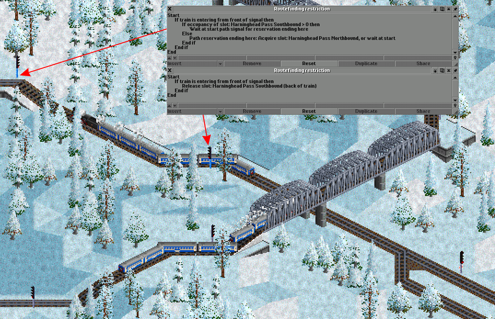

# 信号功能

* [**寻路限制**](#寻路限制)

  玩家可以为任何信号设置寻路限制程序。
  程序可以检查列车属性、槽位与计数器，并依此做出判断，执行特定的操作。
  寻路限制程序可以用来控制寻路系统、路径信号、槽位、限速、掉头与其他操作。

* [**槽位**](#槽位)[^2]

  槽位类似于现实铁路中使用的令牌系统，尤其是单线区段。
  槽位具有最大容量。一列火车可以同时在任意多个不同槽位中。
  列车可以通过信号或条件指令占用或退出槽位。
  在寻路限制和与可编程逻辑信号的程序中以及条件性命令中都可以使用槽位。

* [**计数器**](#计数器)

  计数器是寻路限制程序在火车通过信号时修改的命名变量，
  可以在寻路限制和可编程逻辑信号程序中使用，也可以在条件指令中使用。
  在大多数情况下应使用槽位替代计数器。
  计数器的主要用途是统计火车数量和循环操作。

* [**可编程逻辑信号**](#programmable-pre-signals)

  可编程逻辑信号是带有可编程条件来决定灯号的复合信号，此类信号不是路径信号，因此没有路径信号的一些特性。[^1]

[^1]: 译注：在使用真实制动时无法使用可编程逻辑信号，因为真实制动只允许使用路径信号。详见[真实制动页面](./Realistic-braking.md)
[^2]: 译注：旧版译名为“条目”

## 寻路限制

在游戏中，玩家可以为任何信号设置寻路限制程序。这些程序由列车执行，可以检查列车属性、槽位与计数器。
寻路限制程序可以用来控制寻路系统、路径信号、槽位、限速、掉头与其他操作。\
**需要注意的是，寻路限制需要使用 YAPF 寻路器以工作。**

默认情况下，带有寻路限制程序的电子式信号会使用蓝色信号柱。当使用自定义信号图形时，除非开启“Show restricted electric signals using default graphics”，
否则不会显示蓝色信号柱。

程序中的命令以从上到下的顺序执行。
在一个操作取消另一个操作的情况下，最后执行的操作生效。

### 样例一：港湾与通过式混合车站特殊调度规则

```{figure} images/mixed-station-terminal-roro.png
*港湾与通过式混合车站，注意寻路限制程序区别*
```

图中为港湾与通过式混合车站的一种可行设计。
我们规定，前往*蓝兰栏站*的列车只使用

This is a possible way to implement a combined bay and through station.
The example assumes that only bay-platform traffic calls next at "Southerly Station", which is to the south-east.
The two signals in front of the bay platforms share the program in the upper window.
The signal in front of the north/west bound through platform has the program in the lower window.

The bay platform signals deny access if the train is entering from the back of the signal and the next order (the order after the call at New Bedtown) *is not* Southerly Station.
This has the effect of stopping trains which need to continue north/west from using the bay platforms.
The "train is entering from the back of the signal" test is to avoid restricting trains trying to leave the platforms.

The through platform signal adds a pathfinder penalty if the train is entering from the back of the signal and the next order (the order after the call at New Bedtown) *is* Southerly Station.
This has the effect of adding a penalty for trains which could use the bay platforms, such that those trains will always use a bay platforms if one is available. However if all the bay platforms are full or otherwise unreachable, it can still use the through platform, and reverse out again afterwards.

### 样例二：单越行线车站

```{figure} images/station-with-single-passing-line.png
*单越行线车站。车站为五格长，惩罚和为 4000*
```

图中为双向单越行线车站的一种可行设计。

如果站台未被列车占用，则通过列车将使用站台线通过。
如果站台已被占用，并且列车不在本站停靠，列车将尝试使用中间的越行线

站台格默认会对寻路器附加 800 的惩罚[^signal_penalty]，所以四个站台格一共会产生 4000 的惩罚值。
在这个场景中，越行线上的两架信号都被附加了 2000 的惩罚值。
越行线入口处朝后的信号机有足够大的惩罚值（2000 > 800），因此在站台未被占用时，列车将优先考虑使用站台线通过。
当站台线被占用时，站台线的惩罚值比越行线大，此时列车会使用越行线通过。

[^signal_penalty]: 译注：在使用 YAPF 寻路器时，站台惩罚值可以通过 `yapf.rail_station_penalty` 设置。
详见 [OpenTTDCoop Wiki 上关于 YAPF 寻路器惩罚的详细解释](https://wiki.openttdcoop.org/Penalties)。

寻路限制程序中的接续预留命令是为了让通过列车能够更好地使用中央越行线超越站台上停止的列车。

### 可执行操作

#### 拒绝通过

寻路器会将当前信号视作一条死胡同，并且不会越过信号寻找路径。
本选项可以用来防止列车选用某条路线。

#### 惩罚

寻路器将会被附加一定的惩罚值。
默认值为：小 = 500，中 = 2000，大 = 8000。
本选项可以用来精细调整列车寻路行为。

#### 延续预留

列车预留路径不会在这个信号处结束，就好像信号在前进方向上根本不存在一样。
此操作在应用于有信号的隧道/桥梁入口或出口时没有效果。

#### 接续预留

如果列车的预留路径在这个信号处终止，游戏会尝试从这个信号开始预留另一段路径。
第一段路径和第二段路径无关。第二段路径预留失败不影响第一段路径。
此操作在应用于有信号的隧道/桥梁入口或出口时没有效果。

“接续预留（除非停车）”子操作只在列车的第一段路径不经过其将要停靠的车站或路点时才会尝试开始预留另一段路径。
本子操作用于站台末的信号时可以防止停靠的列车使用接续预留导致效率降低。

#### 槽位操作

[**槽位**](#槽位) 的详细解释在下方。\
所有子操作：

* 占用或等待
  Try to acquire membership in the slot, if the slot is full and the train cannot become a member, wait at this PBS signal.
* 尝试占用
  Try to acquire membership in the slot, if the slot is full and the train cannot become a member, carry on anyway.
  When reserving ahead it is attempted when making the reservation, no second attempt is made when later passing the already reserved signal.
* 车头退出
  Release membership of this slot when the front of the train passes the signal.
* 车尾退出
  Release membership of this slot when the back of the train passes the signal.
* 预留退出
  Release membership of this slot when making a reservation from this signal (this is the executed in the same conditions as the "acquire or wait" and "try to acquire" sub-actions).
* PBS end: Acquire or wait
  When attempting to make a PBS reservation which ends at this signal, try to acquire membership in the slot, if the slot is full and the train cannot become a member, wait at the start PBS signal.
* PBS end: Try to acquire
  When attempting to make a PBS reservation which ends at this signal, try to acquire membership in the slot, if the slot is full and the train cannot become a member, make the reservation anyway.
* PBS end: Release
  When a PBS reservation is made which ends at this signal, release membership of this slot.

#### 新闻控制

新闻控制功能可以关闭在该信号处等待列车的迷路信息。

### 条件控制

* **如果**：开始条件控制块。只有在条件成立的情况下块内的操作才会被执行。
* **否则如果**：本块的内容只有在条件成立，并且之前的所有条件都不成立的情况下才会被执行。
* **或如果**：本块的内容只有在条件成立，并且之前的所有条件都不成立的情况下，或者之前的条件成立的情况下才会被执行。
* **否则**：本块的内容只有在之前所有条件都不成立的情况下才会被执行。
* **结束**：结束条件控制块。

条件控制块可以嵌套在其他条件控制块内。

当选择一个条件控制块时，点击“移除”按钮会移除整个块及其内容。
按住 Ctrl 键点击“移除”按钮会移除条件但不会移除块内的内容。

### 条件
| 条件类型 | 描述 |
| --- | --- |
| **列车长度** | 检查列车的长度，向上取整，以“格”为单位。 |
| **最高速度** | 检查当前列车的最高速度。 |
| **当前指令** | 检查列车当前指令的目的地。 |
| **下条指令** | 检查列车下个指令的目的地。 |
| **最后经过车站** | 检查列车最后经过的车站。 |
| **货物** | 检查列车是否可以运载某种货物。 |
| **装载百分比** | 检查列车已装载的比例。<br>如果列车没有货物容量，游戏将认为其装载比例为 100%。 |
| **进入方向** | 检查列车从哪一侧进入信号所在的格子：<br>前方、后方、绝对方向，或进入/退出隧道/桥梁。 |
| **列车分组** | 检查当前列车是否在某一个特定的分组内。本选项支持嵌套分组。 |
| **列车所有者** | 检查列车所属的公司。 |
| **列车状态** | 检查列车的状态。可检查的状态有：<br>空载、满载、损坏、需要维修、倒车中、<br>正前往车站或路点、正前往车库、装载中、<br>等候中、已迷路、需要维护、在车站或路点停止中。 |
| **重量** | 检查当前列车的重量。 |
| **功率** | 检查当前列车的功率。 |
| **最大牵引力** | 检查当前列车的最大牵引力。 |
| **功率/重量比例** | 检查当前列车的功率/重量比例。 |
| **最大牵引力/重量比例** | 检查当前列车的最大牵引力/重量比例。 |
| **机车类别** | 检查列车是否至少有一辆特定类别的机车。<br>机车类别为：蒸汽、内燃、电力、单轨、磁浮。 |
| **指令目的地方向** | 检查列车当前或下一个指令的目的地相对于信号所在格子的方向。 |

### 高级操作

以下更高级的功能只会在启用“显示高级寻路限制功能”设置后显示。

#### 在路径信号处等待

此操作有以下子操作：

* **在路径信号处等待**：列车在此路径信号处等待。
* **取消在路径信号处等待**：取消之前在路径信号处等待的操作。
* **在起始路径信号处等待以结束此处的预留**：如果列车将进行一个以此信号结束的路径预留，列车将改为在起始信号处等待，并且不会进行预留。
* **取消在起始路径信号处等待以结束此处的预留**：取消之前在起始路径信号处等待以结束此处预留的操作。

#### Reverse

The sub-actions which this can take are:

* Reverse behind signal
  The train reverses behind this signal.
  The signal must be a path signal (not one-way), and the train must be entering from the back direction.
  The pathfinder can follow reverse being signal actions, (within the number of signals where routing restriction programs are evaluated).
* Cancel reverse behind signal
  Cancel a previous reverse behind signal.
* Reverse at path signal
  The trains reverses at this path signal, the train must be approaching from the front direction.
  The pathfinder cannot follow reverse at path signal actions.
  In most cases, reverse behind signal should be used instead.
* Cancel reverse at path signal
  Cancel a previous reverse at path signal.

#### Speed restriction

Set a speed restriction on the train when the train passes the signal.
A value of 0 removes the restriction.

#### Counter operation

See [**Counters**](#计数器) section below for details of what counters are.
The sub-actions which this can take are:

* Increase
  Increase the value of the counter when the front of the train passes this signal.
* Decrease
  Decrease the value of the counter when the front of the train passes this signal. The value will not decrease below 0.
* Set
  Set the value of the counter to a particular value when the front of the train passes this signal.

#### Penalty config

The sub-actions which this can take are:
* No path signal back penalty
  Do not apply the pathfinder penalty for passing this signal from the back side.
* Cancel no path signal back penalty
  Cancel a previous do not apply the pathfinder penalty for passing this signal from the back side.

#### Speed adaptation control

The sub-actions which this can take are:

* Make exempt
  The train is made exempt from automatic speed adaptation when the train passes this signal.
* Remove exemption
  A previous exemption from automatic speed adaptation is removed when the train passes this signal.

#### Signal mode control

This action may be used to override whether a reservation made from a combined normal/shunt style signal
uses normal or shunt mode. The normal/shunt mode affects the displayed signal aspect, and the train driving
model if the train braking is aspect limited setting is enabled.
This action is executed after the reservation has been made.
This requires the realistic train braking model.

### Advanced conditions

The more advanced features below are only shown if the "Show advanced routing restriction features" setting is enabled.

#### Train in slot

This checks whether the train is currently a member of the slot.

#### Slot occupancy

This checks how many trains are members of the slot.

#### Slot occupancy remaining

This checks how much unused capacity there is in the slot, this is the slot capacity minus how many trains are members of the slot.

#### Counter value

This checks the value of a counter.

#### 当前时间/日期

This checks the current time/date. The hour and minute values require that the savegame setting "Show time in minutes instead of days" is enabled.
This is not affected by any use of the setting "Use client time settings instead of savegame time settings".
The time values which can be tested are:

* Minute (0 - 59)
* Hour (0 - 23)
* Hour and minute (0 - 2359)
* Day (1 - 31)
* Month (1 - 12)

#### Reserved tiles ahead

This checks the number of tiles of reservation ahead of the train (rounded down). This requires the realistic train braking model.
This is mainly useful to control the long reserve action.

#### Path reservation passes tile

This checks whether the train's reservation passes through the tile, at any point along its length.

#### Path entry signal

This checks the tile of the path signal where the path reservation is starting from.
Note: When a path reservation passes through a signal using the "Reserve through" or "Long reserve" actions, the passed signal does not become the path entry signal.
This is mainly useful to control the long reserve, reserve through and possibly wait at start path signal for reservation ending here actions.
This condition may not be used with the signal mode control action.

#### Path end signal

This checks the tile of the path signal at the current end of the path reservation. This requires the realistic train braking model.
Note: When a path reservation passes through a signal using the "Reserve through" action, the passed signal does not become the path end signal.
Note: When a second path reservation is started at a signal using the "Long reserve" action or due to the train reserving ahead, the signal does become the new reservation end signal.
This test should be used when checking which signal is used to enter a block when using realistic braking, instead of the path entry signal condition, which could return a signal closer to the train.
This is mainly useful to control the reserve through and possibly wait at start path signal for reservation ending here actions. This is not useful for controlling the long reserve action.
This condition may not be used with the signal mode control action.

#### Path reservation end tile

This condition may ONLY be used with the signal mode control action.
This condition checks the tile at the end of the reservation (the last reserved tile), after the reservation has been made from this signal.
This requires the realistic train braking model.

Note that the path entry/end signal conditionals are somewhat tricky to use and can have non-intuitive behaviour when used with pathfinding/penalty actions,
because pathfinding also takes place beyond the current signal block where any reservation is being made. In this case a prediction of what the path signal would be
is made.

## Programmable pre-signals

Programmable pre-signals are combo pre-signals, with programmable conditions for whether the signal is red or green.
Programmable pre-signals are block signals, with no support for path signalling.
Programmable pre-signal programs cannot test any properties of trains, and are run even if there is no train approaching the signal.
In most cases, routefinding restrictions are more useful.

Unlike routefinding restrictions, programmable pre-signal programs end when the first "Set signal state" line is reached.

Programmable signals are not shown in the signal window by default, **"Show programmable pre-signal feature"** must be enabled.


## 槽位

槽位[^2]类似于现实铁路中使用的路签系统，尤其是单线区段。
槽位具有最大容量。一列火车可以同时在任意多个不同槽位中。
列车可以通过信号或条件指令占用或退出槽位。
在寻路限制和与可编程逻辑信号的程序中以及条件性命令中都可以使用槽位。

在游戏中，可以通过列车列表下拉菜单中的“槽位管理”选项创建、删除、重命名槽位，改变槽位容量，以及
手动添加列车至槽位与手动从槽位移除列车。

汽车、飞机与船只也可以使用槽位。不过，这些载具只能通过条件性命令来检查槽位的占用率或占用与退出槽位。
每种载具类别的槽位之间互相分离。

### 样例一：使用槽位与“拒绝通过”操作使列车在侧线等候


在这个例子中，一次只能有一列回收物资列车在车站等候满载。
其他列车必须在某处等候，直到站台可用。

回收物资列车在经过最右侧的信号（第一个信号）时将尝试占用槽位

在尝试经过第二个信号时，如果回收物资列车不在槽位内（没有成功占用），信号会拒绝列车通过与越过信号寻路。
在这种情况下，列车被迫寻路至并驶入等候侧线以等候。

列车将会在侧线出口信号前无限等待，直到可以占用槽位。


如果列车从正面通过站台线出口处的信号（即离开站台），则列车退出槽位。
槽位清空，可以被另外一列车占用。

槽位管理窗口中的槽位有“1/1”字样标记。这意味着槽位的最大容量为 1，且当前有 1 列车正占用槽位。槽位已满。
槽位内的列车则显示在右侧。图中右侧的列车即为正在站台内的列车。

### 样例二：使用槽位与条件性命令分流列车至侧线等候排队


样例二与样例一类似，唯一的不同点在于使用了条件性命令将无法占用槽位的列车分流到侧线等候排队。
使用条件性命令的优势在于列车无需进入侧线。在图中的情况下，要求列车每次都必须驶入侧线以求可以使用
信号寻路限制程序控制槽位显然是不明智的。

在通过命令 #16 处的路点后，列车会评估命令 #17（条件性命令）的条件。
如果列车已经在槽位内，或者可以占用槽位，列车马上跳至命令 #21，并且跳过在侧线排队的指令——显然在
槽位未满的情况下列车不需要排队。
如果槽位已满，且列车不可以占用槽位，列车不会跳至命令 #21，而是会跳到命令 #18，从而使列车在
一条调车线掉头，并将列车分流至侧线等候排队。
侧线上的信号带有路由限制程序，确保列车在可以占用槽位之前不会离开侧线。


上图显示了命令 #16—#21 的位置关系。
使用条件性命令可以使排队侧线的布局与选择更加灵活。

### 样例三：使用条件性命令与槽位动态调度列车


在这个例子中，一组共享调度命令的火车从生产火车站运输货物。
当其中一座火车站的货物超过等待阈值时，列车会决定从侧线调度一列火车到该站。
（例子中的侧线也可以替换成车库或者车站）。每座火车站都有一个关联的槽位，容量均为 1，
保证一次只调度一列车至车站。

通过这种操作可以节省需要的火车数量。火车数量可以少于火车站的数量。

对于每一个生产火车站，列车调度计划中有一套特殊的设置：

1. 使用条件性命令以确保车站有足够的货物，如果没有则跳过
2. 尝试占用此车站的槽位，如果占用失败（即此时已经有列车调度至该车站）则跳过
3. 前往车站并装载货物
4. 退出车站槽位
5. 前往接收站并卸载货物
6. 返回侧线

如果条件未满足，没有可以前往的火车站，列车不会离开调度侧线（或车库/路点/车站），从而将列车重新引导至调度侧线。


需要注意的是，应该在侧线命令中添加表定等待时间。

### 样例四：单线区间双向信号

在这个样例中有一个双向信号化单线区间。在上行/下行两个方向上均有信号灯，按一定间隔均匀放置。
多列火车可以同时在同一方向上行驶。
使用槽位可以避免火车在单线区间中同时朝相反方向行驶而相互阻塞的死锁情况。

上行与下行方向各有一个关联槽位。每个槽位的容量等同于区间中可以同时行驶的列车数量。


图中两列北上列车正在单线区间内。北向槽位的最大容量为 2，且两列车均占用了北向槽位。
此时南向槽位为空。

如果南向槽位当中有列车，即南向槽位非空，列车会在单线区间前的信号处等待，且不会占用北向槽位。
列车离开单线区间后即退出槽位。


与此同时，一列车正因为北向槽位当中有列车而在区间另一端等待。在北向槽位清空，没有列车北上之前，这列车不会占用南向槽位，也不会通过信号。

当地形、费用或其他限制因素导致修建双轨线路非常困难，但又需要更大的运载能力时，可以考虑使用这种布局。
如果不在单线区间内设置信号，那么一次只能有一列火车在区间内行驶。

**变种：**槽位占用和在单线区段入口等待的部分可以移动到单线区段内的第一个信号处。
当双线与单线区间的连接处刚好是一个主要交叉口，且不是所有列车都前往单线区间时，这种设计可以发挥其优势。

同样，槽位退出的部分可以移动到单线区段内的最后一个信号处。

需要进行信号方向测试，以便在相反方向通过信号时不应用槽位操作。



### 样例五：列车超车——慢速列车分流


在这个样例中，如果慢速列车后面有一列或多列快速列车，它们就会自动转向侧线，以便快车超车。
信号根据列车是否可以运载乘客来区分快慢列车，但也可以使用其他条件，如最高速度、当前目的地、列车编组、列车重量等。

快速列车将尝试在侧线前占用槽位。为了保证快速列车可以顺畅通过，槽位的容量应当足够大，以便多列列车占用槽位。

侧线末尾的信号被设置为拒绝让槽位内的列车通过。已在槽位内的快车绝不应该使用侧线通过。
在侧线内的列车会一直等待，直到槽位内没有剩余列车。

主线上的信号在槽位未空时会对未在槽位内的列车附加惩罚以在侧线无车且慢车后有快车时将慢车分流至侧线，
且在槽位内的快车在通过信号后会退出槽位。
附加的惩罚值不应过大，并且绝不能将“添加惩罚”替换为“拒绝通过”，否则在两列慢车在前，一列快车在后的场景下，
两列车会相互阻塞，从而堵住侧线。

使列车占用槽位的信号与侧线之间应当保持足够的距离以确保慢车不会立刻进入侧线，
距离也不应过长，防止快车连续通过导致慢车无法离开侧线。

### 槽位的其他可能用途

* 复杂单线线路
* 拥堵排队控制
* 预防枢纽死锁
* 整体冲突预防
* 设置交叉优先
* 多列车条件性命令调度

## 计数器

计数器是寻路限制程序在火车通过信号时修改的命名变量，
可以在寻路限制和可编程逻辑信号程序中使用，也可以在条件指令中使用。
计数器的主要用途是统计火车数量和循环操作。

如果要统计特定轨道区段上的火车数量，应使用槽位。

使用计数器存储当前状态可以替代原版游戏中的“逻辑列车”和类似的变通方法。

计数器默认情况下不会显示在用户界面中，必须启用**“Show advanced routing restriction features”**以显示计数器。

在游戏中，可以通过列车列表下拉菜单中的“计数器管理”选项创建、删除、重命名，与设置计数器。


