# 信号

* [**寻路限制**](#寻路限制)

  在游戏中，玩家可以为任何信号设置寻路限制程序。这些程序由列车执行，可以检查列车属性、槽位与计数器。
  寻路限制程序可以用来控制寻路系统、路径信号、槽位、限速、掉头与其他操作。

* [**可编程逻辑信号**](#programmable-pre-signals)

  可编程逻辑信号是带有可编程条件来决定灯号的复合信号，此类信号不是路径信号，因此没有路径信号的一些特性。

* [**槽位**](#槽位)

  槽位类似于现实铁路中使用的令牌系统，尤其是单线区段。
  槽位具有最大容量。一列火车可以同时在任意多个不同槽位中。
  列车可以通过信号或条件指令占用或退出槽位。
  在寻路限制和与可编程逻辑信号的程序中以及条件性命令中都可以使用槽位。

* [**计数器**](#counters)

  计数器是一种命名的变量，可在列车通过信号时变化。
  在寻路限制和与可编程逻辑信号的程序中以及条件性命令中都可以使用计数器。
  在大多数情况下，应改用槽位，而不是计数器。

## 寻路限制

在游戏中，玩家可以为任何信号设置寻路限制程序。这些程序由列车执行，可以检查列车属性、槽位与计数器。
寻路限制程序可以用来控制寻路系统、路径信号、槽位、限速、掉头与其他操作。\
**需要注意的是，寻路限制需要使用 YAPF 寻路器以工作。**

默认情况下，带有寻路限制程序的电子式信号会使用蓝色信号柱。当使用自定义信号图形时，除非开启“Show restricted electric signals using default graphics”，
否则不会显示蓝色信号柱。

程序中的命令以从上到下的顺序执行。
在一个操作取消另一个操作的情况下，最后执行的操作生效。

### 样例一：港湾与通过式混合车站特殊调度规则

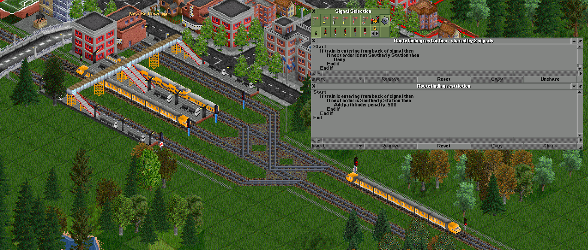

图中为港湾与通过式混合车站的一种可行设计。
我们规定，来自南方“未来南站”的列车只停靠港湾式站台。

如果列车从信号灯后方驶入，而下一个指令（在新贝德敦呼叫后的指令）**是南向车站**，则直通月台信号灯会增加一个探路惩罚。
这样做的效果是对可以使用港湾式站台的列车增加了惩罚，因此如果有港湾式站台，这些列车将始终使用港湾式站台。但是，如果所有月台都满员或无法到达，列车仍可使用直通月台，之后再倒车驶出。

This is a possible way to implement a combined bay and through station.
The example assumes that only bay-platform traffic calls next at "Southerly Station", which is to the south-east.
The two signals in front of the bay platforms share the program in the upper window.
The signal in front of the north/west bound through platform has the program in the lower window.

The bay platform signals deny access if the train is entering from the back of the signal and the next order (the order after the call at New Bedtown) *is not* Southerly Station.
This has the effect of stopping trains which need to continue north/west from using the bay platforms.
The "train is entering from the back of the signal" test is to avoid restricting trains trying to leave the platforms.

The through platform signal adds a pathfinder penalty if the train is entering from the back of the signal and the next order (the order after the call at New Bedtown) *is* Southerly Station.
This has the effect of adding a penalty for trains which could use the bay platforms, such that those trains will always use a bay platforms if one is available. However if all the bay platforms are full or otherwise unreachable, it can still use the through platform, and reverse out again afterwards.

### 样例二：单越行线车站

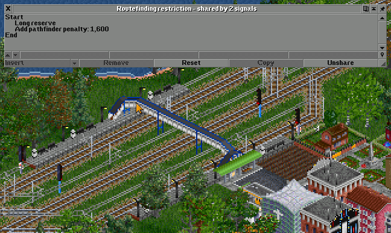

图中为双向单越行线车站的一种可行设计。

如果站台未被列车占用，则通过列车将使用站台线通过。
如果站台已被占用，并且列车不在本站停靠，列车将尝试使用中间的越行线

站台格默认会对寻路器附加 800 的惩罚，所以四个站台格一共会产生 3200 的惩罚值。
在这个场景中，越行线上的两架信号都被附加了 1600 的惩罚值。
越行线入口处朝后的信号机有足够大的惩罚值（1600 > 800），因此在站台未被占用时，列车将优先考虑使用站台线通过。
当站台线被占用时，站台线的惩罚值比越行线大，此时列车会使用越行线通过。

寻路限制程序中的长预留命令是为了让通过列车能够更好地使用中央越行线超越站台上停止的列车。

### 可执行操作

#### 拒绝通过

寻路器会将当前信号视作一条死胡同，并且不会越过信号寻找路径。
本选项可以用来防止列车选用某条路线。

#### 惩罚

寻路器将会被附加一定的惩罚值。
默认值为：小 = 500，中 = 2000，大 = 8000。
本选项可以用来精细调整列车寻路行为。

#### Reserve through

PBS will not end a reservation at this PBS signal, it is as if the signal is not there at all in the forward direction.
This action has no effect when applied to a signalled tunnel/bridge entrance or exit.

#### Long reserve

If a train makes a PBS reservation that ends at this PBS signal, a second separate reservation will be attempted starting from this signal.
The first reservation is not cancelled if the second reservation is not possible.
This action has no effect when applied to a signalled tunnel/bridge entrance.

The "Long reserve (unless stopping)" sub-action can be used to only enable long reserve when the train is not stopping at a station or waypoint,
earlier in the train's reservation. This is useful for signals at platform ends where it would not be useful to enable long reserve for trains which will be stopping.

#### 新闻控制

新闻控制功能可以关闭在该信号处等待列车的迷路信息。

### 条件控制

* **如果**
  开始条件控制块。只有在条件成立的情况下块内的操作才会被执行。
* **否则如果**
  本块的内容只有在条件成立，并且之前的所有条件都不成立的情况下才会被执行
* **或如果**
  The contents of this block are only executed if the condition is true AND none of the previous conditions in this conditional block were true, OR if the previous condition in this conditional block was true.
* **否则**
  The contents of this block are only executed if none of the previous conditions in this conditional block were true.
* **结束**
  This ends the conditional block.

Conditional blocks may be nested inside other conditional blocks.

When a conditional block is selected, clicking the "Remove" button removes the entire block and its contents.
Ctrl-clicking the "Remove" button removes the condition but does not remove the contents of the block.

### 条件

#### 列车长度

检查列车的长度，向上取整，以“格”为单位。

#### 最高速度

检查当前列车的最高速度

#### 当前指令

This checks the destination of the train's current order.

#### Next order

This checks the destination of the train's next order after the current order.

#### Last visited station

This checks which station the train last visited.

#### 货物

检查列车是否可以运载某种货物。

#### Load percentage

This checks the current load percentage of the train.
(Trains with no cargo capacity at all are considered full: 100%).

#### Entry direction

This checks which side the train is entering the signal from: front, back, compass direction, or entering/exiting tunnel/bridge.

#### Train group

This checks whether the train is in a particular group.
This works with nested groups.

#### Train owner

This checks which company owns the train.

#### Train status

This checks the current status of the train, the statuses which can be checked are:

* Empty
* Full
* Broken down
* Needs repair
* Reversing
* Heading to station or waypoint
* Heading to depot
* Loading
* Waiting
* Lost
* Requires servicing
* Stopping at station/waypoint

#### 重量

检查当前列车的重量

#### 功率

检查当前列车的功率

#### 最大牵引力

检查当前列车的最大牵引力

#### Power / weight

This checks the train's current power to weight ratio.

#### Max T.E. / weight

This checks the train's current maximum tractive effort to weight ratio.

#### 机车类别

This checks whether the train has at least one engine of a particular class. The engine classes are:

* Steam
* Diesel
* Electric
* Monorail
* Maglev

#### Direction of order target

This checks which direction the tile of the train's current or next order is in, relative to the signal tile.

### Advanced actions

The more advanced features below are only shown if the "Show advanced routing restriction features" setting is enabled.

#### Wait at PBS signal

The sub-actions which this can take are:

* Wait at PBS signal
  The train waits at this PBS signal.
* Cancel wait at PBS signal
  Cancels a previous wait at PBS signal action.
* Wait at start PBS signal for reservation ending here
  If a train would make a PBS reservation which ends at this signal, the train will instead wait at the start signal and not make the reservation.
* Cancel wait at start PBS signal for reservation ending here
  Cancel a previous wait at start PBS signal for reservation ending here.

#### Slot operation

See [**Slots**](#槽位) section below for details of what slots are.
The sub-actions which this can take are:

* Acquire or wait
  Try to acquire membership in the slot, if the slot is full and the train cannot become a member, wait at this PBS signal.
* Try to acquire
  Try to acquire membership in the slot, if the slot is full and the train cannot become a member, carry on anyway.
  When reserving ahead it is attempted when making the reservation, no second attempt is made when later passing the already reserved signal.
* Release (front)
  Release membership of this slot when the front of the train passes the signal.
* Release (back)
  Release membership of this slot when the back of the train passes the signal.
* Release (on reserve)
  Release membership of this slot when making a reservation from this signal (this is the executed in the same conditions as the "acquire or wait" and "try to acquire" sub-actions).
* PBS end: Acquire or wait
  When attempting to make a PBS reservation which ends at this signal, try to acquire membership in the slot, if the slot is full and the train cannot become a member, wait at the start PBS signal.
* PBS end: Try to acquire
  When attempting to make a PBS reservation which ends at this signal, try to acquire membership in the slot, if the slot is full and the train cannot become a member, make the reservation anyway.
* PBS end: Release
  When a PBS reservation is made which ends at this signal, release membership of this slot.

#### Reverse behind signal

The train reverses behind this signal. The signal must be a PBS signal (not one-way), and the train must be entering from the back direction.

#### Speed restriction

Set a speed restriction on the train when the train passes the signal.
A value of 0 removes the restriction.

#### Counter operation

See [**Counters**](#counters) section below for details of what counters are.
The sub-actions which this can take are:

* Increase
  Increase the value of the counter when the front of the train passes this signal.
* Decrease
  Decrease the value of the counter when the front of the train passes this signal. The value will not decrease below 0.
* Set
  Set the value of the counter to a particular value when the front of the train passes this signal.

#### Penalty config

The sub-actions which this can take are:

* No PBS back penalty
  Do not apply the pathfinder penalty for passing this signal from the back side.
* Cancel no PBS back penalty
  Cancel a previous do not apply the pathfinder penalty for passing this signal from the back side.

#### Speed adaptation control

The sub-actions which this can take are:

* Make exempt
  The train is made exempt from automatic speed adaptation when the train passes this signal.
* Remove exemption
  A previous exemption from automatic speed adaptation is removed when the train passes this signal.

#### Signal mode control

This action may be used to override whether a reservation made from a combined normal/shunt style signal
uses normal or shunt mode. The normal/shunt mode affects the displayed signal aspect, and the train driving
model if the train braking is aspect limited setting is enabled.
This action is executed after the reservation has been made.
This requires the realistic train braking model.

### Advanced conditions

The more advanced features below are only shown if the "Show advanced routing restriction features" setting is enabled.

#### Train in slot

This checks whether the train is currently a member of the slot.

#### Slot occupancy

This checks how many trains are members of the slot.

#### Slot occupancy remaining

This checks how much unused capacity there is in the slot, this is the slot capacity minus how many trains are members of the slot.

#### Counter value

This checks the value of a counter.

#### Current time/date

This checks the current time/date. The hour and minute values require that the savegame setting "Show time in minutes instead of days" is enabled.
This is not affected by any use of the setting "Use client time settings instead of savegame time settings".
The time values which can be tested are:

* Minute (0 - 59)
* Hour (0 - 23)
* Hour and minute (0 - 2359)
* Day (1 - 31)
* Month (1 - 12)

#### Reserved tiles ahead

This checks the number of tiles of reservation ahead of the train (rounded down). This requires the realistic train braking model.
This is mainly useful to control the long reserve action.

#### PBS reservation passes tile

This checks whether the train's reservation passes through the tile, at any point along its length.

#### PBS entry signal

This checks the tile of the PBS signal where the PBS reservation is starting from.
Note: When a PBS reservation passes through a signal using the "Reserve through" or "Long reserve" actions, the passed signal does not become the PBS entry signal.
This is mainly useful to control the long reserve, reserve through and possibly wait at start PBS signal for reservation ending here actions.
This condition may not be used with the signal mode control action.

#### PBS end signal

This checks the tile of the PBS signal at the current end of the PBS reservation. This requires the realistic train braking model.
Note: When a PBS reservation passes through a signal using the "Reserve through" action, the passed signal does not become the PBS end signal.
Note: When a second PBS reservation is started at a signal using the "Long reserve" action or due to the train reserving ahead, the signal does become the new reservation end signal.
This test should be used when checking which signal is used to enter a block when using realistic braking, instead of the PBS entry signal condition, which could return a signal closer to the train.
This is mainly useful to control the reserve through and possibly wait at start PBS signal for reservation ending here actions. This is not useful for controlling the long reserve action.
This condition may not be used with the signal mode control action.

#### PBS reservation end tile

This condition may ONLY be used with the signal mode control action.
This condition checks the tile at the end of the reservation (the last reserved tile), after the reservation has been made from this signal.
This requires the realistic train braking model.

Note that the PBS entry/end signal conditionals are somewhat tricky to use and can have non-intuitive behaviour when used with pathfinding/penalty actions,
because pathfinding also takes place beyond the current signal block where any reservation is being made. In this case a prediction of what the PBS signal would be
is made.

## Programmable pre-signals

Programmable pre-signals are combo pre-signals, with programmable conditions for whether the signal is red or green.
Programmable pre-signals are block signals, with no support for PBS.
Programmable pre-signal programs cannot test any properties of trains, and are run even if there is no train approaching the signal.
In most cases, routefinding restrictions are more useful.

Unlike routefinding restrictions, programmable pre-signal programs end when the first "Set signal state" line is reached.

Programmable signals are not shown in the signal window by default, **"Show programmable pre-signal feature"** must be enabled.

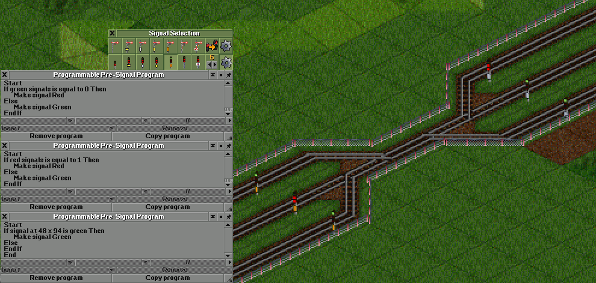

## 槽位

槽位类似于现实铁路中使用的令牌系统，尤其是单线区段。
槽位具有最大容量。一列火车可以同时在任意多个不同槽位中。
列车可以通过信号或条件指令占用或退出槽位。
在寻路限制和与可编程逻辑信号的程序中以及条件性命令中都可以使用槽位。

默认情况下，“槽位”选项不会在界面中显示。必须启用“Show advanced routing restriction features”以显示槽位功能。

在游戏中，可以通过列车列表下拉菜单中的“槽位管理”选项创建、删除、重命名、改变容量、手动添加列车至槽位，或手动从槽位移除列车。

汽车、飞机与船只也可以使用槽位。不过，这些载具只能通过条件性命令来检查槽位的占用率或占用与退出槽位。每种载具类别的槽位之间互相分离。

### 样例一：使用槽位与“拒绝通过”操作使列车在侧线等候

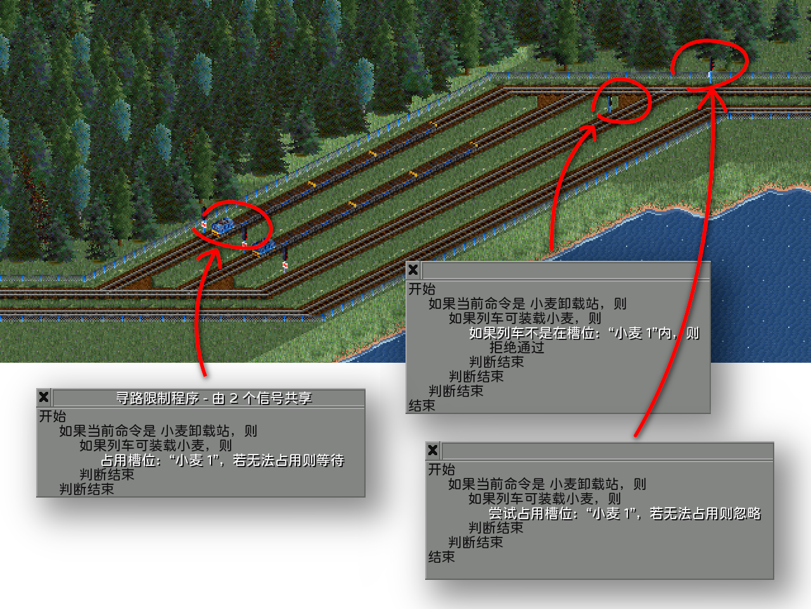

在这个例子中，一次只能有一列回收物资列车在车站等候满载。
其他列车必须在某处等候，直到站台可用。

回收物资列车在经过最右侧的信号（第一个信号）时将尝试占用槽位

在尝试经过第二个信号时，如果回收物资列车不在槽位内（没有成功占用），信号会拒绝列车通过与越过信号寻路。
在这种情况下，列车被迫寻路至并驶入等候侧线以等候。

列车将会在侧线出口信号前无限等待，直到可以占用槽位。

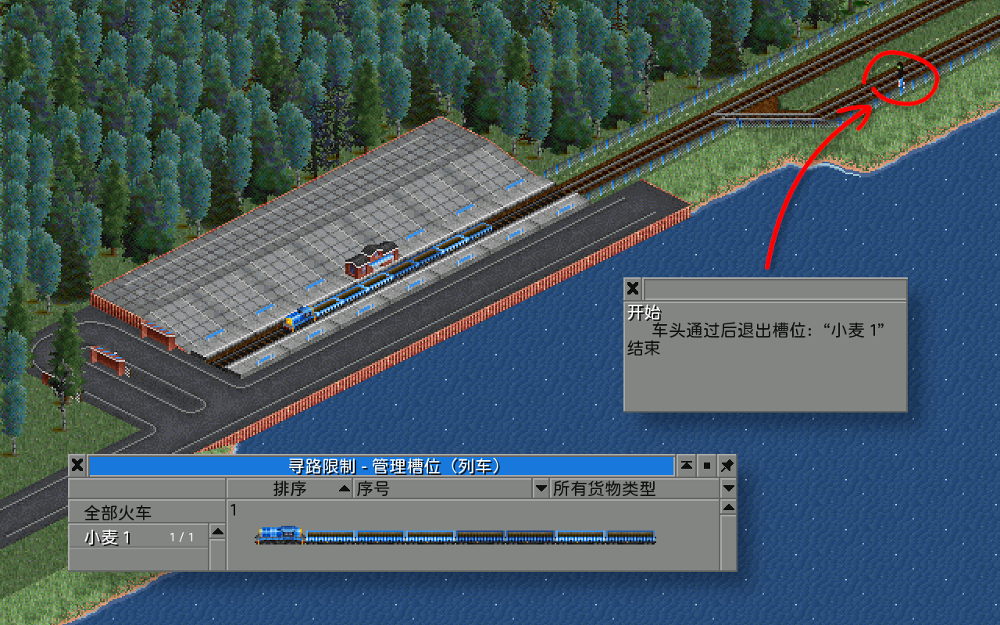

如果列车从正面通过站台线出口处的信号（即离开站台），则列车退出槽位。
槽位清空，可以被另外一列车占用。

槽位管理窗口中的槽位有“1/1”字样标记。这意味着槽位的最大容量为 1，且当前有 1 列车正占用槽位。槽位已满。
槽位内的列车则显示在右侧。图中右侧的列车即为正在站台内的列车。

### 样例二：使用槽位与条件性命令分流列车至侧线等候排队

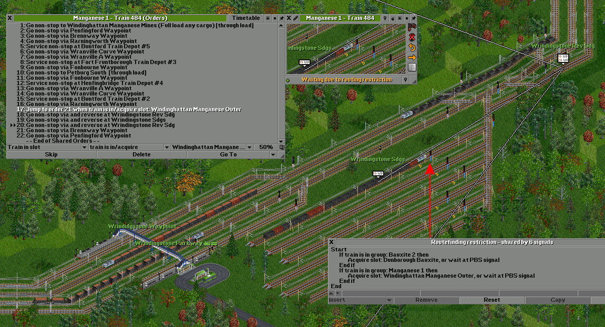

样例二与样例一类似，唯一的不同点在于使用了条件性命令将无法占用槽位的列车分流到侧线等候排队。
使用条件性命令的优势在于列车无需进入侧线。在图中的情况下，要求列车每次都必须驶入侧线以求可以使用
信号寻路限制程序控制槽位显然是不明智的。

在通过命令 #16 处的路点后，列车会评估命令 #17（条件性命令）的条件。
如果列车已经在槽位内，或者可以占用槽位，列车马上跳至命令 #21，并且跳过在侧线排队的指令——显然在
槽位未满的情况下列车不需要排队。
如果槽位已满，且列车不可以占用槽位，列车不会跳至命令 #21，而是会跳到命令 #18，从而使列车在
一条调车线掉头，并将列车分流至侧线等候排队。
侧线上的信号带有路由限制程序，确保列车在可以占用槽位之前不会离开侧线。

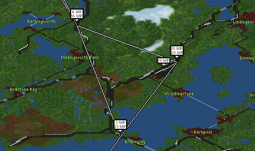

上图显示了命令 #16—#21 的位置关系。
使用条件性命令可以使排队侧线的布局与选择更加灵活。

### Example 3: Using conditional orders and slots for dynamic dispatch of trains

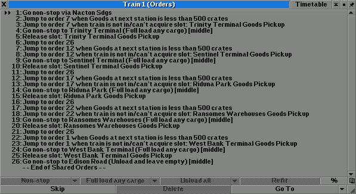

In this example a single set of trains with shared orders services multiple producing stations.
When one of the producing stations has more than a threshold quantity of cargo waiting, a single train is dispatched from
the sidings to that station.
(Alternatively a depot or station could be used instead of sidings).
Each producing station has an associated slot of capacity 1. This is to ensure that only one train at a time is dispatched to each station.

This allows using fewer trains than there are loading stations to be serviced.

For each of the producing stations:

1. Use a conditional order to check whether there is enough cargo waiting at the station, if not skip this station.
2. Try to acquire the slot for this station, if not (meaning that another train has already been dispatched there) skip this station.
3. Go to the producing station and load cargo.
4. Release the slot for the station.
5. Go to the accepting station and unload cargo.
6. Return to the sidings.

The train will not move from the waiting sidings waypoint/depot/station if there are no stations available to load from such that the conditional
order jumps lead to the order for the waypoint/depot/station where the train is already waiting.

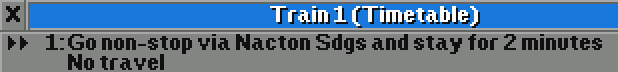

A timetabled wait time should be added to the sidings waypoint, depot or station order where the train waits.

### Example 4: Bidirectionally signalled lines

In this example a single track line is signalled in both directions.
Multiple trains can travel in the same direction on the line at once.
Slots are used to avoid a deadlock where trains travel in opposite directions on the single line at the same time and block each other.

One slot is required for each direction. Each slot should have a capacity at least as large as the number of trains which could
be travelling in the same direction at the same time.

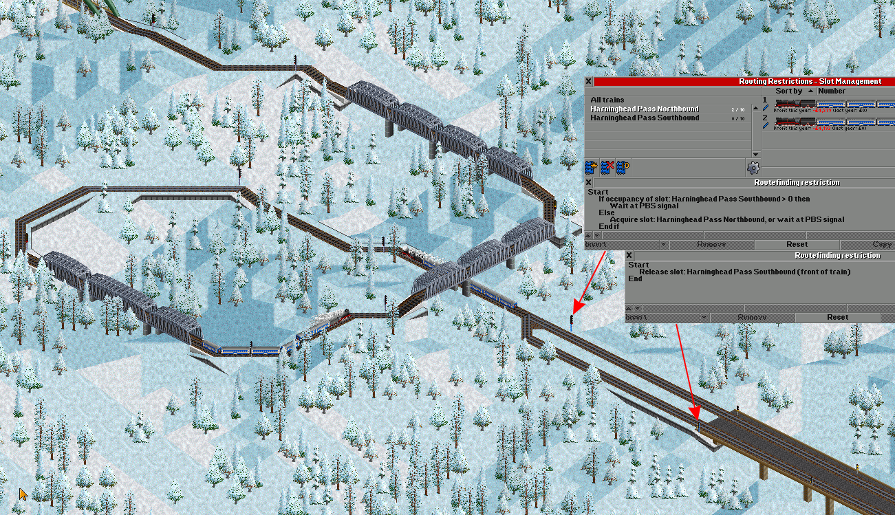

Here two trains have entered the single line heading north. Both trains acquired the northbound slot, such that the occupancy of the northbound slot is two,
and the southbound slot is empty.

If the southbound slot was not empty, the trains would wait at the signal before the single track and not acquire the northbound slot.

The slot is released after the train has left the single track section.

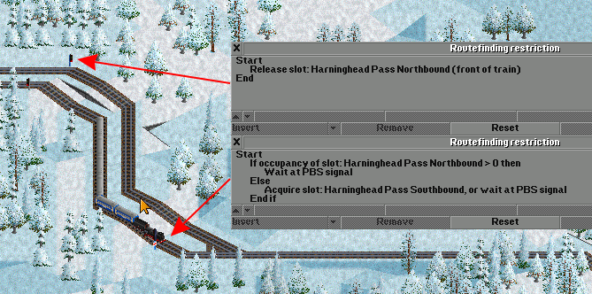

At the other end, a train is waiting because the northbound slot is not empty. It does not acquire the southbound slot and proceed past the signal
until the northbound slot is empty, indicating that there are no trains using the single line heading north.

This type of layout is useful when terrain, expense or other constraints make double-tracked lines impractical, but more capacity is required than can be achieved
by not signalling the single track at all such that only one train could occupy the single track at once.

### Example 5: Diverting slow trains into a siding to allow fast trains behind to overtake

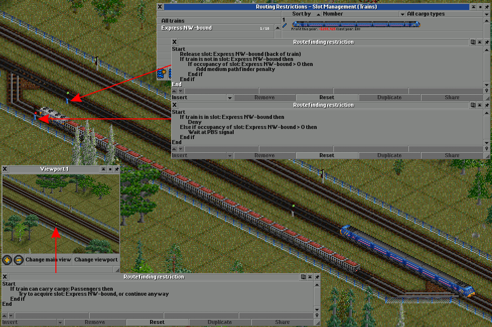

In this example, slow trains are automatically diverted into a siding if they're followed by one or more fast trains, to allow them to overtake.
This example uses the train's cargo (passengers) to differentiate between fast and slow trains, but this could instead be done using other conditions
such as maximum speed, current destination, train group, train weight, etc.

Well ahead of the siding (shown in the inset viewport), trains considered "fast" try to acquire the slot.
The slot capacity should be large enough to that a fast train will always be able to acquire the slot, even if there
are other fast trains in the section.

The signal at the end of the siding is set to deny trains which are in the slot. Fast trains which have acquired the slot should never use the siding.
Trains which are in the siding should wait there until there are no trains in the slot.

The signal on the mainline track adds a pathfinder penalty for trains which are not in the slot, if the slot is not empty.
This diverts slow trains into the siding if there is one or more fast trains behind and the siding is empty.
Deny or a very large penalty should not be used, as this can cause a deadlock if two slow trains
are followed by a fast train, and the second slow train stops on the mainline waiting for the siding to become available.
This signal also releases the slot from fast trains as they go past.

The distance between the slot acquire signal and the siding should be far enough that a slow train in front won't have reached the siding yet, but not so long
that a slow train in the siding doesn't get a chance to exit before another fast train comes past.

### 槽位的其他可能用途

* 复杂单线线路
* 拥堵与排队控制
* 防止平面交叉的列车死锁现象
* 多列车条件性命令调度
* 整体性冲突预防
* 设置交叉优先

## Counters

Counters are named variables which can be modified by a routefinding restriction program when a train passes a signal.
Counters can be used in conditionals in routefinding restrictions and programmable pre-signal programs, and in conditional orders.
The main use case for counters is counting trains and round-robin behaviour.
For counting the number of trains on a particular section of track, slots should be used instead.

Using counters to store state makes "logic trains" and similar workarounds unnecessary.

Counters are not shown in the user interace by default, **"Show advanced routing restriction features"** must be enabled.

Counters can be created, deleted, renamed and have their value manually changed by selecting "Manage counters" in the train list window "Manage list" dropdown.

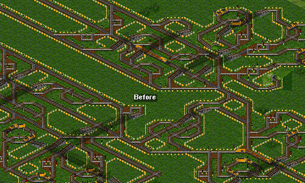 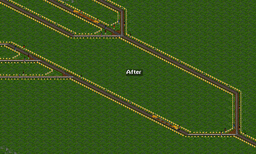 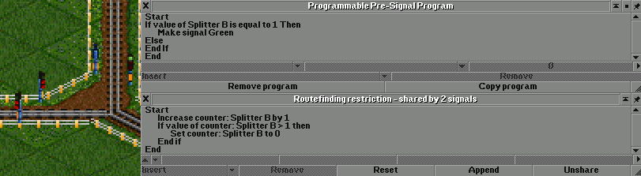
