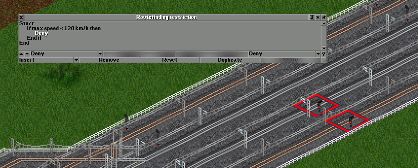

# 寻路限制编程

在这里我将介绍一些寻路限制在游戏中的运用实例。[^rspp]
部分例子在预防冲突与节省基建时几乎是唯一解决方案。
对寻路限制与寻路限制程序的合理运用可以很大程度上提升运行的顺滑度，
同时也降低阻塞的风险。虽然单一程序可能耗不起眼，但程序积少成多，
最终你的网络会让在其上运行的列车快速且准确。

[^rspp]: 译注：寻路限制（Routefinding restriction）和可编程逻辑信号（Programmable pre-signal）是两个极其容易混淆的概念。
寻路限制仅适用于路径信号，可编程逻辑信号只适用于可编程逻辑信号（橙色灯牌）
两者之间的差异在于可编程逻辑信号本质上来说还是逻辑信号（通过、进出口、复合），
所以不需要预留一段路径。
而寻路限制本质上是给路径信号路径预留增加了限制，需要预留路径。
详细解释参见“[信号](../Features/Signalling.md)”章节。

## 如何配置

```{figure} images/basic_pbs/zoning-restricted.png
:width: 80%
*高亮路由限制信号*
```
首先要介绍的就是分区功能当中的一个选项。
你可以在分区选项中设置高亮寻路限制信号，这样就可以快速找到你特别设置过的信号灯。[^remove_signal]
防止你误删除设置过的信号。

[^remove_signal]: 译注：实际上如果完全使用 8bpp 图像，且信号灯的灯杆是灰色或蓝灰色，在开启“寻路限制信号使用蓝色灯柱”时，
游戏会自动将这些信号的灯柱替换为蓝色，所以可以不使用文中所述分区功能。不过，“启用蓝色灯柱”不适用于这些情形：
灯柱不是蓝色的，或图像不是 8bpp 的（即图像为 32bpp）。

为了给信号灯编制寻路限制程序，你需要点选信号灯菜单中的齿轮图标。
点选后，点击你所需编程的信号。
这就是寻路限制菜单了。

```{figure} images/basic_pbs/routefinding-restriction-how-to-open.png
*如何打开寻路限制菜单*
```

## 简单信号路径优先

寻路限制信号编程的一大作用是*确定优先级*。这里是一个优先级的例子。
具体实现优先级需要这两种操作当中的一种，我个人认为接续预留的效果最好：

```{figure} images/basic_pbs/image-005.png
*使用接续预留的例子*
```

* [延续预留](../Features/Signalling.md#延续预留)（Reserve through）

  *列车预留路径不会在这个信号处结束，就好像信号在前进方向上根本不存在一样。*
  *此操作在应用于有信号的隧道/桥梁入口或出口时没有效果。*

* [接续预留](../Features/Signalling.md#接续预留)（Long reserve）

  *如果列车的预留路径在这个信号处终止，游戏会尝试从这个信号开始预留另一段路径。*
  *第一段路径和第二段路径无关。第二段路径预留失败不影响第一段路径。*
  *此操作在应用于有信号的隧道/桥梁入口或出口时没有效果。*

客运列车的优先级比货运列车高。在图中的设置下，客运列车的预留路径在到达信号灯时会触发一连串的接续预留操作，
从而保证在客运列车和货运列车同时抵达或货运列车稍早抵达的情况下，客运列车可以优先通过。

如果你想要把范围缩小一点，比如不包括在主线上运行的货运列车，你可以通过添加一个“如果”声明，
专门用于针对特定种类的列车。

```{figure} images/basic_pbs/image-006.png
*添加了如果声明的程序*
```

比如，如果你只想让客运列车获得优先级，你可以将“如果”的条件改为“列车可以运载旅客”。


```{tip}
你可以复制寻路限制程序以节省时间。
在编制程序时，你可以通过使用“复制”按钮
从其他信号复制程序。[^share_rr]
```

[^share_rr]: 译注：实际上在这里也可以共享命令，在“复制”按钮的右侧是“共享”按钮，
按住{kbd}`Ctrl`即可共享信号程序。


如果你注意力敏锐的话，你肯定会发现这些操作一次只能让一列火车优先通过。
如果有两班优先列车连续通过（比如在繁忙线路上），后通过的列车仍会被截停。
这个时候就要使用[槽位](../Features/Signalling.md#槽位)了。

另一方面，延续预留防止拥堵的效果很好。
举例来说，如果有一列超长货车要通过一座车站，并且站台长度比列车长度要短，
站台的每一条到发线都是一个独立的信号区间。
如果放任列车进入而不做任何调整，列车容易卡在车站咽喉区从而堵住整座车站。
为了防止这种情况，你可以在寻路限制中使用延续预留。

现在超长列车再也不会卡在车站信号前了。


## 使用拒绝通过与惩罚引导列车

“拒绝通过”在列车分类上至关重要——我最喜欢的例子就是将列车分流至快慢线路上。
列车分类可以用极少的工作量极大地提升路网效率。

假设你有一条双复线铁路[^fufuxian]，并希望慢车在外侧轨道上运行，快车在内部轨道上运行，
你可以在线路开始的地方设置寻路限制程序。在程序里，你可以添加一个条件判断，
根据列车的最高速度决定允许或拒绝列车通过。


[^fufuxian]: 译注：~~複々線~~ [四线铁路](https://zh.wikipedia.org/zh-cn/%E5%9B%9B%E7%B7%9A%E9%90%B5%E8%B7%AF)
（[百度百科](https://baike.baidu.com/item/%E5%9B%9B%E7%B7%9A%E9%90%B5%E8%B7%AF/15567746)）

在“插入”选项卡中选择“如果”，选择“最高速度”作为判断的条件。
在输入目标速度 120 千米/时后就需要选择判断范围。
我这里不想让最高速度在这个数值以上的列车进入轨道，所以选择“大于等于”作为判断范围。


输入完成后，再选中“判断结束”插入“拒绝通过”。


最终的结果就是这样：

```{line-block}
开始
    如果最高速度 ≥ 120 千米/小时，则
        拒绝
    结束判断
结束
```


现在，任何速度大于 120 千米/小时的列车都无法进入外侧轨道。

同理，你需要给内侧轨道的信号附加类似的程序。这次需要做出一些改变，
拒绝所有最高速度低于 120 千米/小时的列车。



在配置完成之后，你就得到了一条快慢分离的双复线线路。
快慢分离可以预防列车拥堵的潜在风险，
因此在启用直通运转并且你的线路上有其他公司的慢车运行时非常重要，反之亦然。


拒绝通过还有千万种使用方式。通过使用拒绝通过，你可以完全控制线路上列车的去向，
同时也允许你为列车分类来提高运营效率。

惩罚与拒绝通过类似，不过惩罚并不会“立即拒绝通过”——
如果你想要分流列车，同时又想要留有余地，不直接拒绝通过，
你就可以使用“添加惩罚”来保证回转的空间。

比如，在这个情景中，假设铁路上有运转中的快车和慢车，
同时列车都希望进入站台，
但是又不希望在站台被占用的时候直接让列车在信号机前等候导致堵车，
就可以将程序当中的“拒绝”替换为“添加惩罚”。


可见慢车没有驶入快车专用站台，
但并不妨碍慢车在慢车站台全部被占用的情况下驶入快车站台。


这些简易寻路限制编程技巧可以帮助你控制列车混合运行，
也有助于提升路网管理技术和公司间列车管理能力。
