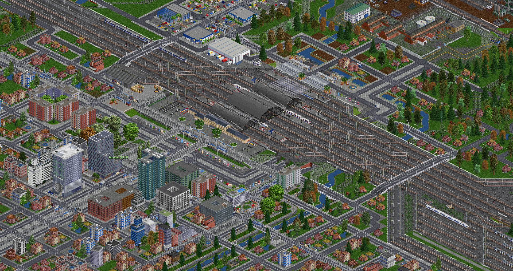
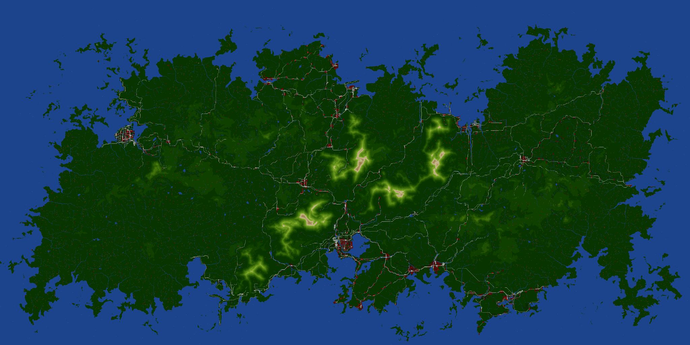
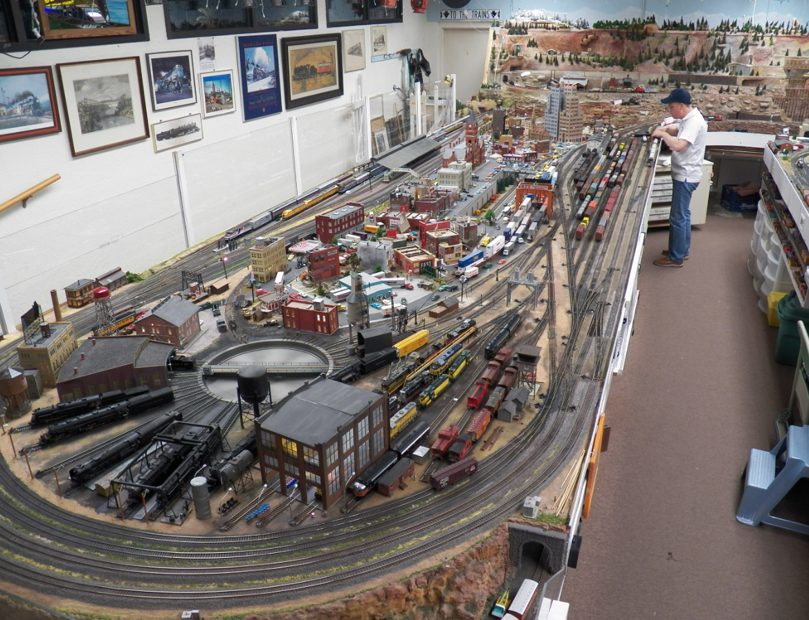

# OTTD 模型铁路新手指南

```{note}
本指南可以作为百科的补充。百科当中并未提及计划调度等功能，指南当中有详细的解释。

原始链接：[Kale's Model Railroad Tutorials](https://www.tt-forums.net/viewtopic.php?p=1270083#p1270083)\
原作者：KaleTrans (Kale)\
Post by KaleTrans » 26 Jun 2024 09:53
```

## 前言

你好！我是 Kale，你们友好的社区版主。
我在空闲时间里喜欢在我们都熟知和喜爱的游戏 OpenTTD 中创建极其宏大的像素铁路工程。

我不是这款游戏的专家，但无论如何，OpenTTD 的前作《运输大亨》也是个老游戏了。
我大概是在六岁开始玩《运输大亨》的，当时用的电脑还是经典的米黄色，跑着 Windows 98。
我只会随便跑跑火车，或者漫无目的地铺设轨道——我那时我只是个喜欢火车的小屁孩儿。
后来我长大了，重新回到这款游戏，并学会了怎么玩
我会连接每一个产业和城镇，打通所有的场景，等等等等。
但即使在 2000 年代初，这款游戏也已经显出老态：
地图很小，基本功能缺失，拓展性也很差，所以我就不再玩了。
一旦赚你了很多钱并买下了竞争对手，游戏就会很快变得无聊。

```{figure} images/openttd-versions.png
*不同版本的《运输大亨》*
```

可以肯定地说，就游戏性而言，《运输大亨》的潜力也就到此为止了：
这款游戏的游戏性并不是太好。
在这个游戏中赚钱很快变得太容易，最终只会稍微拖慢你的进度，
而不是需要通过策略或战术来克服的障碍。
我看到很多人在讨论区中谈论他们赚了多少钱，
而我要说的是——你们错过了最精彩的部分。
你们拥有有史以来在操作深度和规模上最出色的火车游戏，而你们却只是为了赚钱？我要挑战这种观念。

---

快进到 2023 年——这款游戏已经经历了多次开源迭代，模组制作也已持续了数十年，
于是你就得到了现在的 OpenTTD：
这款游戏经历了许许多多的更新，开发者们增加了许许多多的功能，
玩家们创作了许许多多的 NewGRF，最重要的是——这款游戏的补丁包。

我不会深入解释开源项目的根基，你只需要知道，这款游戏迄今为止最受欢迎的补丁包是 JGR 补丁包（JGRPP，JGR's Patch Pack）。
JGRPP 添加了许多拿手功能，优化了游戏性能，实现了全新的功能机制，
并真正将已经大大改进的原版游戏变成了一款拥有深度的游戏。JGRPP 让我将向你展示的一切成为可能。



JGRPP 的修改数不胜数：从节省时间的小修改，到载具时刻表精细化管理（计划调度），
再到可以在任何老爷机上[^1]运行国家大小的地图[^2]的优化
（我这里不是在开玩笑，任何类似的游戏都不可能做到一样的地图大小和比例），
这些改进终于让你可以在一个《狂热运输》或者《铁路帝国》都无法望其项背的比例上自由搭建铁路沙盒。
你可以修建这样一条线路：特快列车需要花费等同于现实中三十分钟的时间走完全程。
你可以修筑这样一座城市：地铁网络交叉其间，从市中心，到郊区，再到工业区、港口区，一直到你引以为傲的超大火车站，每个地方都生机勃勃、活力十足。
当你能够稍微分散一下地图上的景物时，这一切就显得更合理了。



这张截图来源于我的私人服务器。
在你阅读这篇文章的时候，我们已经在这张 8192 × 4096 的地图上工作了几个月了——但一切仍只是刚刚开始。
地图中主要城市的规模与《运输大亨》中的整个地图相当。
在地图上，新干线列车驰骋于城市之间，往返于北境与南边。
客运列车和货运列车有条不紊地按时刻表运行着。
列车的时刻表和调度计划指引着他们前往目的地，
而旅客可以在城市之间自由旅行。
高峰时期，列车满载，从车站驶出的列车确保无论何时站点之间都紧密连接。
其实游戏根本没有什么目标，有的只是填满地图上的每一处，与确保你的火车正确运行。
为了这个目标，火车迷们在他们的地下室的小沙盒中花费了数钱美元，也为此牺牲了数年的时间。
那么为什么不在游戏里也这样干呢？而且还是免费的？而且还没有空间限制？



当然了，OpenTTD 没有和其他新游戏一样漂亮的 3D 图形，并且也和地下室里的沙盒不同。
但 OpenTTD 不用花一分钱，也不需要 32GB 的运行内存来运行模组。
我不会对你撒谎，说：“这一段旅程没有任何痛苦”。
这款游戏的底子已经有 30 年了，并且游戏本身完全由志愿者和爱好者维护。
游戏本身自然会有一些奇怪的限制，部分地方也并不是很直观。
你会花几个小时处理一些乏味的事情，然后发现如果在正确的地方按住 Ctrl 点击，同样的过程只需要 5 分钟。
这是我认为这种游戏风格只适合那些玩了多年的老玩家的原因之一。

这就是我的用武之地。我将尝试引导你走向启蒙。打开无限金钱，打开魔法推土机，忘记传统玩法，拥抱这个既奇怪，又令人沮丧，而且迷人强大的 OpenTTD。你已经意识到从“商业大亨游戏”到“迷人的 2D 火车和城市沙盒”的哲学转变，现在你准备好了。

[^1]: 译注：当然，你不能让鲁大师在你的老爷机里抽烟。
不过 OpenTTD（尤其是 JGRPP）对性能要求其实并不高。
一块普通的树莓派 3B+ 就足以编译且运行 OpenTTD。
游戏在计算方面负载实际上很小，主要负载来源于图像渲染，
而图像渲染也可以使用硬件加速。

[^2]: 译注：8192 × 4096 以上的大小就已经不是正常游玩的范围了。还有，不是每个国家都有中国那么大。
