# 计划调度—制定 60 分钟时刻表

在本教程中，我将解释如何使用 JGRPP 当中最棒的功能之一——计划调度。
我会展示两种实现方案，分别是 60 分钟时刻表与 24 小时时刻表。
60 分钟时刻表虽然相对简单但其也可以用来处理复杂调度[^1]。
24 小时时刻表较 60 分钟时刻表而言更复杂，反直觉，
不过这种运营方式更适合于使用 P&T 脚本[^2]的游戏

[^1]: 译注：[Rico's Archipelago Map](https://discord.com/channels/142724111502802944/1134148110654902292)
[^2]: 译注：[Peaks and Troughs](https://www.tt-forums.net/viewtopic.php?t=87840)
（尖峰时刻）游戏脚本可以用来模拟一天不同时段的客流量。游戏脚本由 Erato 开发。

图中所示示例铁路路线的列车完全按计划调度与调度计划[^3]运行。
为整条线路上的列车制定时刻表是一个循序渐进的过程。理想的方法是先制定一列列车的时刻表
（根据需求灵活决定列车列数），
列车在运行的过程中会通过自行记录行车时间与等候时长（停站时长）自动填充时刻表。
我个人习惯单独制定停站时长，所以行车时间相对而言较为重要。
之后开启“自动时刻表”并让列车运行即可。

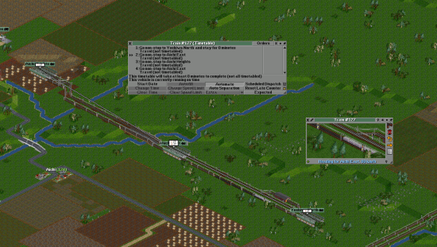

[^3]: 译注：两者在名称上极为相似，但“计划调度”（Scheduled Dispatch）是 JGRPP 独有的功能，
允许制定更复杂的时刻表，
而“调度计划”（Order List）自《运输大亨》起就在游戏中，
是规定列车行走路线的工具。

列车运行时会自动填充时刻表，同时也设立车站间运行的标准时间。
时刻表窗口的右侧栏中就是确切的到发时间。

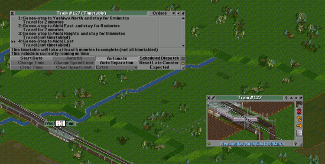

你可以在列车的时刻表填充完成之后查看列车的运行时间。
确定所有运行时间之后就可以制定计划调度时刻表了。
运行时间已经确定，因此也不再需要启用“自动时刻表”获取运行时间。
现在你可以关掉“自动”选项然后为你认为必要的站点手动设定停站时间。
双击命令即可修改停站时间。
我在样例中规定每个站点的停站时间为一分钟。
在修改完之后就可以打开计划调度页面了。

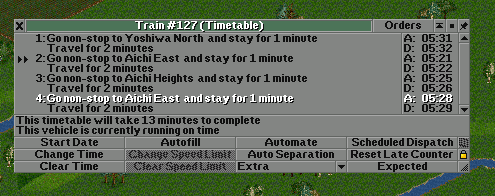

在启用计划调度之后，你还需要将时刻表指定到一项命令。
这里我们将时刻表指定到“吉和北站”，也是东侧的终点站。

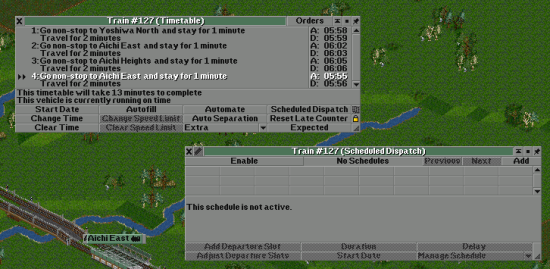

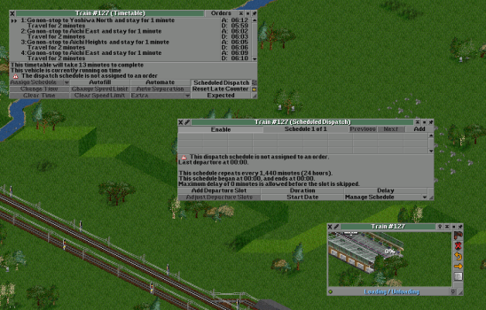

我们已经设置完毕了计划调度指令，可以添加发车时间[^4]了。
遵循这个时刻表的列车在该站时只会在发车时间发车。

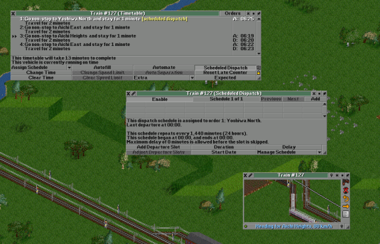

[^4]: 译注：旧版译名为“出发条目”。

既然我们做的是 60 分钟时刻表，在运营前要做的第一件事自然就是将时刻表时长修改为 60 分钟。
60 分钟的时刻表会每小时[^5]重复一次。有助于简化计划调度操作，也有助于与其他路线混合运行。
在添加发车时间时可以按 Ctrl 键批量添加发车时间。
不过制定 24 小时时刻表的时候你就需要手动添加发车时间了[^6]。
在这里我将时刻表设定为从 0000 开始到 0100 结束，每 5 分钟一班。

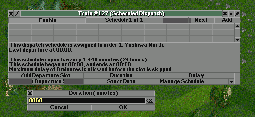

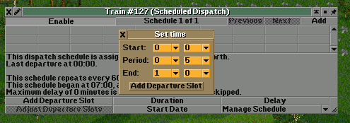

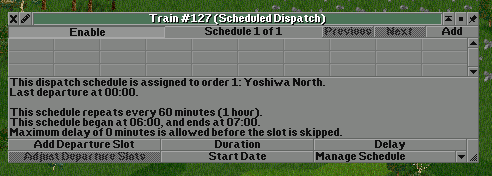

[^5]: 译注：游戏时间。
[^6]: 译注：实际上在 24 小时时刻表中也可以使用批量功能，
作者原意为“24 小时时刻表需要更多的手动调整”，而不是“功能在 24 小时时刻表中不可用”。

结果就是这样的。全部发车时间设置完毕。时刻表的一小时将无限循环，
发车时间也会被自动调整到对应时间。
计划调度时刻表窗口还提供了一些额外信息，
如“本时刻表需要 3 辆载具”说明使用 3 部载具恰好完全利用所有出发时间。

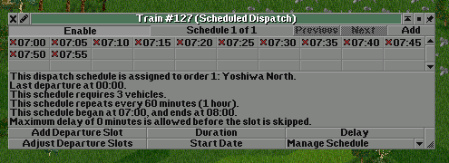

这里我又购买了两列列车（在复制列车时按住 Ctrl 键点击就可以共享调度计划）
来保证可以完全利用所有出发时间。

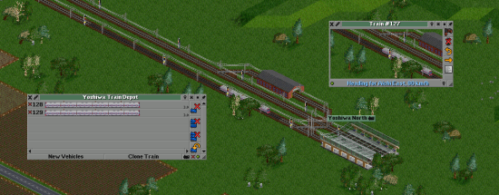

我们的系统已经开始运作了。列车每 5 分钟从吉和北站发车，在走完全程后又折回终点站，
再次等候发车。如果操作正确，一次只应该有一列车在车站等候发车时间。

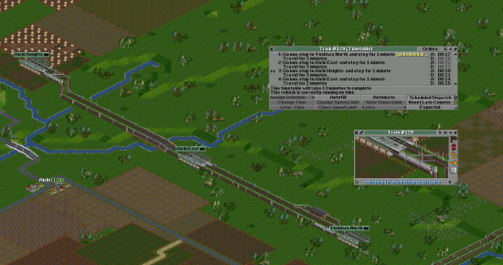

---

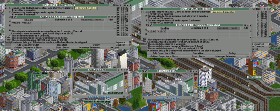

这里有一个来自 Reddit JGR Server 3 的例子。LHAM 08 是一列普通列车，各站停车，
而 EHAM 04 是一列快车，不在所有站点停靠。诚然，快车的路线可能比慢车短，
并且哪怕让快车在慢车后面开出，快车也可以在路途中超越快车。
不过如果能让慢车在快车后开出事情就简单得多了。
你不需要建设一些快车专用轨道和站台，需要做的只是在列车的时刻表当中设置一下。
这样可以大大节省轨道与基础设施的数量。

---

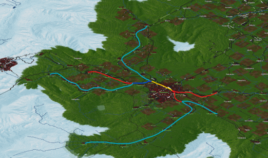

这是另外一个例子，同样来源于 Reddit JGR Server 3。图中是滨松市的铁路系统，
其中淡蓝色意味着每小时三班车（即 20 分/班），红色是每小时六班车（10 分/班），
黄色是每小时十二班车（5 分/班）。所有的列车都使用计划调度精确定时。
在系统中，每五分钟就会有一列车经过中央站的黄色标记部分运行，如果没有大面积延误事件。
借助计划调度，可以使用尽可能少的载具，实现尽可能少的拥堵，同时输送大量客流。
